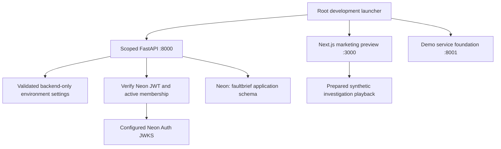
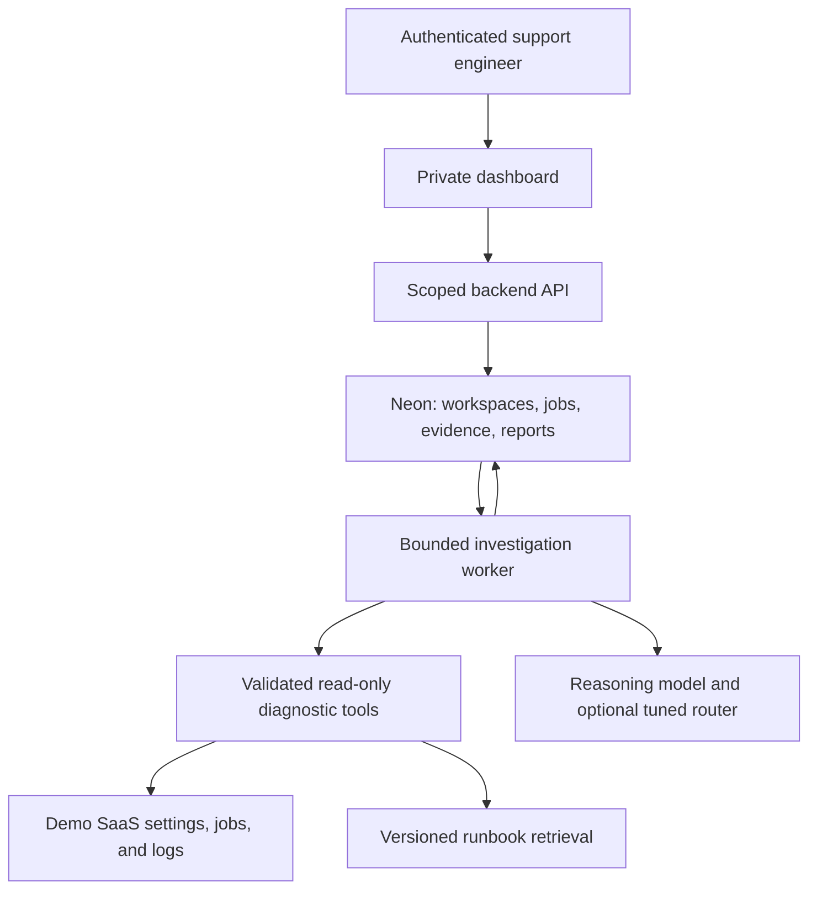

# Architecture

## Implemented foundation

The marketing samples are local UI playback. The API verifies JWT identity and workspace membership, persists scoped customer/case/job records in Neon, and exposes typed evidence/report/feedback contracts. The Next.js frontend implements Neon SDK signup/login, session guards, and a server-side JWT API proxy. Ledger, the separate reporting demo, exposes customer/permission/config/job/log evidence and protected scenario controls backed by isolated SQLite. Its evaluator writes private answers outside the diagnostic service. The FaultBrief investigation worker, bounded tool orchestration, runbook retrieval, and model execution are later milestones. See [database/API contracts](database-api.md).

## Planned investigation runtime

The subscribing workspace and its affected customer are distinct scopes. The backend enforces both; the model cannot grant itself access. Model and database credentials stay on the server. Fine-tuning is a separate offline workflow, with model promotion based on evaluation.

Object storage, external AI gateways, and serverless application functions are optional additions when a concrete requirement justifies them.
