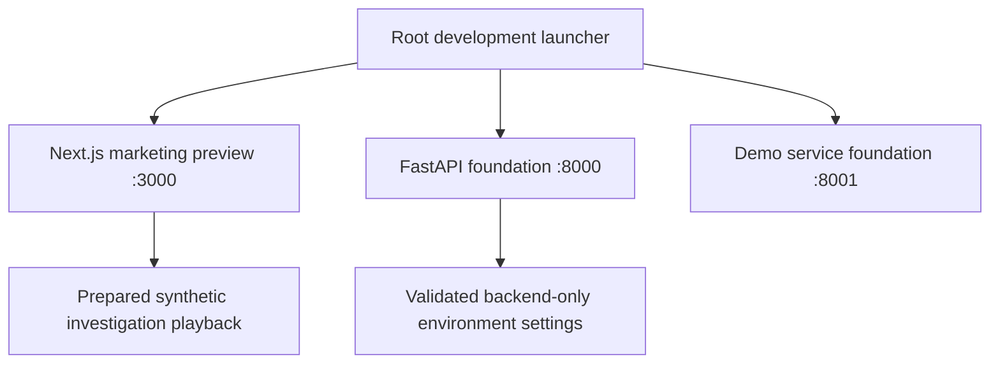
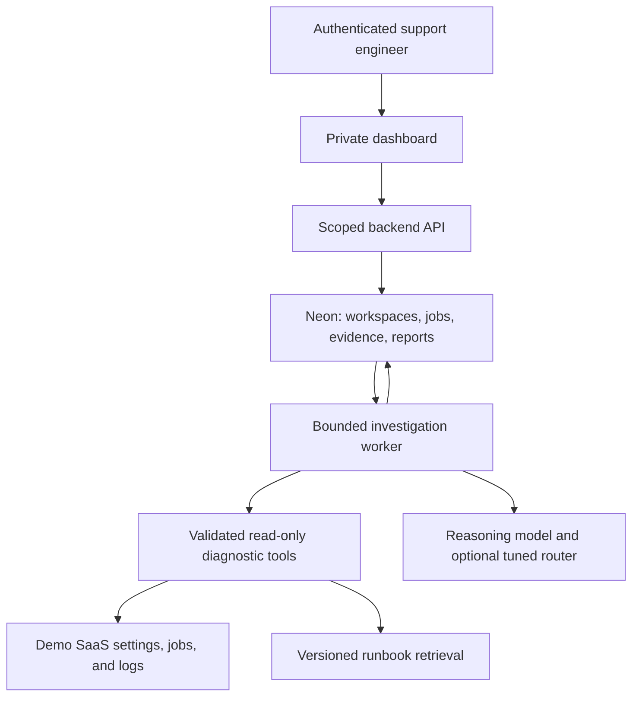

# Architecture

## Implemented foundation

The marketing samples are local UI playback. The API and demo expose separate liveness endpoints. There is no live connection between the samples, Neon, the demo service, or a model yet.

## Planned investigation runtime

The subscribing workspace and its affected customer are distinct scopes. The backend enforces both; the model cannot grant itself access. Model and database credentials stay on the server. Fine-tuning is a separate offline workflow, with model promotion based on evaluation.

Object storage, external AI gateways, and serverless application functions are optional additions when a concrete requirement justifies them.
